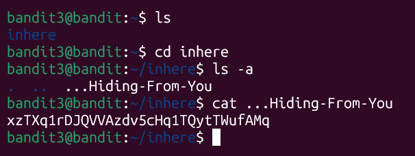

# Bandit Level 3 -> Level 4
* **Objective:** Find the password hidden in a file inside the inhere directory.
* **Commands Used:** cd inhere,   
                     ls -a,   
                     cat ...Hiding-From-You
* **What I Learned:** Files or directories starting with a dot (.) are hidden in linux and won't show up with a regular ls.
                      Using ls -a reveals all hidden items. Additionally, filenames can literally contain multiple dots, so you must type the exact name witout adding extra characters.

* **Passowrd Saved:**[ xzTXq1rDJQVVAzdv5cHq1TQytTWufAMq]
 

