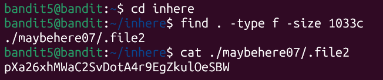
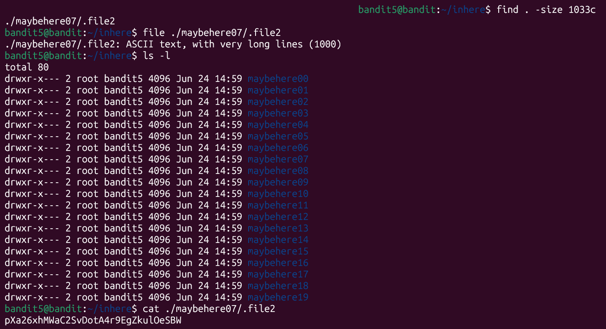

# Bandit Level 5 -> Level 6

* **Objective:** Find the password stored in a file somewhere under the inhere directory that is human-readable, 1033 bytes in size, and not executable.
* **Commands Used:**
    * **Method 1:**
      
      cd inhere

      find . -type f -size 1033c

      cat ./maybehere07/.file2

      
      
    * **Method 2:**
      
      find . -size 1033c

      file ./maybehere07/.file2

      ls -l

      cat ./maybehere07/.file2

      

      

* **What I Learned:** 
    * The `find` command searches through directory trees based on specific options. Using `.` targets the current folder and its sub-directories.
    * The `-type f` option filters out folders to look only for standard files.
    * The `-size 1033c` option searches for an exact byte size, where the `c` suffix explicitly stands for bytes/characters.
    * In **Method 1**
     Combining `-type f` and `-size 1033c` pinpoints the target file instantly.
    * In **Method 2**
    Searching purely by `-size 1033c` works as well, and using `file` on the path confirms it's the correct human-readable `ASCII text` file before reading it.
    * Linux needs space for arguments to work properly. Typing `cd..` returns a command error, while `cd ..` successfully moves you up a directory level. Leaving out the dash before a parameter (like writing `.size`) makes the system mistake the command for a folder name.

* **Password Saved:** '[pXa26xhMWaC2SvDotA4r9EgZkul0eSBW]'