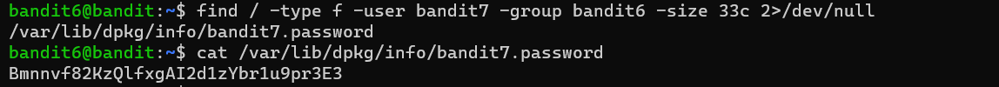

# Bandit Level 6 -> Level 7

* **Objective:** Find the password stored in a file somewhere on the server that is owned by user `bandit7` and owned by group `bandit6` and exactly `33 bytes` in size..
* **Commands Used:**
   
        find / -type f -user bandit7 -group bandit6 -size 33c 2>/dev/null
   
        cat /var/lib/dpkg/info/bandit7.password
    

* **What I Learned:**
    * The `find /` command starts a search from the system root directory to scan every folder on the server.
    * The `-user bandit7` and `-group bandit6` options filter the system-wide search specifically for files matching those ownership permissions.
    * The `2>dev/null` part is essential for global root searches; it silences all the standard error noise (like "Permission denied" lines)so the only winning path pops up clearly.
    * Once the absolute file path (`/var/lib/dpkg/info/bandit7.password`) is located, running `cat` directly on it reveals the password text.

## Screenshots

### Execution & Verification

* **Password Saved:** `[Bmnnvf82KzQLfxgAI2dlzYbr1u9pr3E3]`
