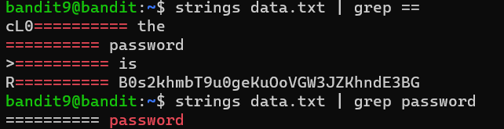

# Bandit Level 9 -> Level 10

* **Objective:** Find the password for the next level stored in the binary file `data.txt`, which is preceded by several `=` characters.
* 
**Commands Used:**
    ```
    strings data.txt | grep "=="
    ```

* **What I Learned:**
    * `strings`: Scans a binary or data file and extracts only the human-readable text strings, filtering out all the unreadable junk data.
    * `grep "=="`: Searches through those text strings and pulls out only the lines containing the equal signs, leading us straight to the password.

## Screenshots

### Execution & Verification


* **Password Saved:** [ B0s2khmbT9u0geKuOoVGW3JZKhndE3BG]