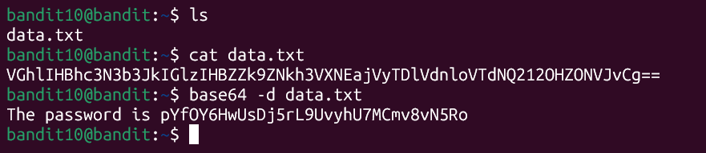

# Bandit Level 10 -> Level 11

* **Objective:** Find the password for the next level stored in the file `data.txt`, which contains base64 encoded data.
* **Commands Used:**
    ```
    base64 -d data.txt
    ```

* **What I Learned:**
    * `base64`: A command-line utility used to encode or decode data using the Base64 representation standard.
    * `-d`: The decode flag used to translate the scrambled Base64 string back into human-readable plain text.

## Screenshots

### Execution & Verification


* **Password Saved:** [pYfOY6HwUsDj5rL9UvyhU7MCmv8vN5Ro]
