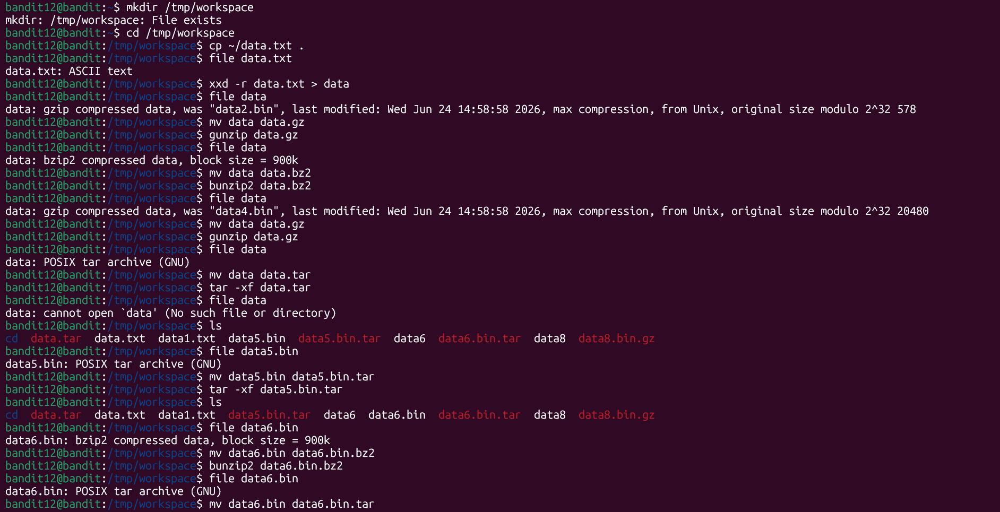
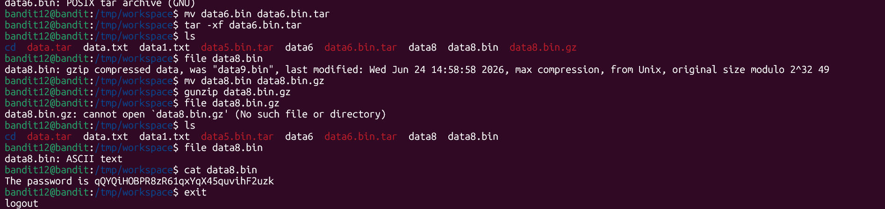

# Bandit Level 12 -> Level 13

* **Objective:** Find the password for the next level  stored in the file data.txt, which is a hexdump of a file that has been repeatedly compressed. `For this level it may be useful to create a directory under /tmp in which you can work. Use mkdir with a hard to guess directory name. Or better, use the command “mktemp -d”. Then copy the datafile using cp, and rename it using mv (read the manpages!)`

* **Commands Used:**
  
  ```
  mkdir /tmp/workspace
  cd /tmp/workspace
  cp ~/data.txt .
  xxd -r data.txt > data
  mv data data.gz && gunzip data.gz
  mv data data.bz2 && bunzip2 data.bz2
  mv data data.gz && gunzip data.gz
  mv data data.tar && tar -xf data.tar
  mv data5.bin data5.bin.tar && tar -xf data5.bin.tar
  mv data6.bin data6.bin.bz2 && bunzip2 data6.bin.bz2
  mv data6.bin data6.bin.tar && tar -xf data6.bin.tar
  mv data8.bin data8.bin.gz && gunzip data8.bin.gz
  cat data8.bin
  ```
 * **What I Learned:**

`xxd -r` converts a hexdump back into its original binary format.
`file` identifies the real type of a file.
`mv` renames files so extraction tools recognize proper extensions.
`gunzip` extracts gzip-compressed files.
`bunzip2` extracts bzip2-compressed files.
`tar -xf` extracts files from tar archives.

* **Screenshots**
* **Execution & Verification**



* **Password Saved:**  `qQYQiHOBPR8zR61qxYqX45quvihF2uzk`