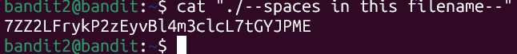

# Bandit Level 2 -> Level 3

* **Objective:** Find the password hidden in a file named '--spaces in this filename--'.
* ** Commands Used:** 'cat "./--spaces in this filename--"'
* **What I Learned:** Files starting with dashes (--) confuse commands like 'cat'. Prepending './' forces Linux to treat it as a file path instead of an option argument.
* **Password Saved:** [ZZ2LFrykP2zEyvBl4m3clcL7tGYJPME]

