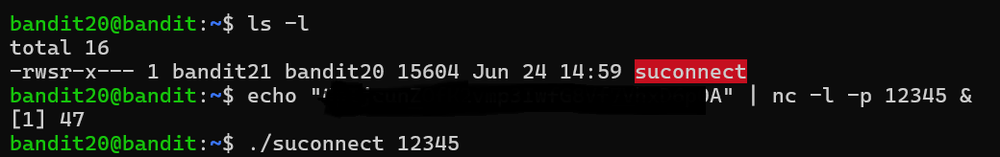

# Bandit Level 20 → Level 21

* **Objective:**

The goal of this level was to use local network communication to send the current level password through a localhost port and retrieve the password for bandit21.

* **Commands Used:**

1. Login to bandit20
`ssh bandit20@bandit.labs.overthewire.org -p 2220`

2. List Files
`ls -l`

Then I found the file: suconnect

3. Check Program Behavior:

`./suconnect`

The program explained that it:

connects to a localhost port
expects the current level password
returns the next level password if authentication succeeds.

* **Method 1 — Single Terminal Using Background Process**
(Start Listener in Background)
`echo "CURRENT_BANDIT20_PASSWORD" | nc -l -p 12345 &`

(Connect Using suconnect)

`./suconnect 12345`

**Method 2 — Using Two Separate Terminals**

Terminal 1 — Start Listener

Login to bandit20:

`ssh bandit20@bandit.labs.overthewire.org -p 2220`

Start listener:

`echo "CURRENT_BANDIT20_PASSWORD" | nc -l -p 4444`

This terminal remains active waiting for a connection.

Terminal 2 — Connect Using suconnect

Open another terminal and login again:

`ssh bandit20@bandit.labs.overthewire.org -p 2220`

Run:

`./suconnect 4444`


**Verification**(Background Process Method)
```
echo "CURRENT_BANDIT20_PASSWORD" | nc -l -p 4444 &
./suconnect 4444

```
Two-Terminal Method

Terminal 1

`echo "CURRENT_BANDIT20_PASSWORD" | nc -l -p 4444`
Terminal 2
`./suconnect 4444`

Example Output

Password matches!
[next-password-hidden]

* **What I Learned**

Localhost networking enables communication between programs on the same machine.
Netcat (nc) can create simple TCP listeners.
Linux supports foreground and background processes.
Multiple SSH sessions can work together simultaneously.
Ports are fundamental to network communication.
Real-World Relevance


Netcat is frequently used for:

debugging services
testing network ports
troubleshooting connectivity
penetration testing

 # screenshots:


# password verification message


