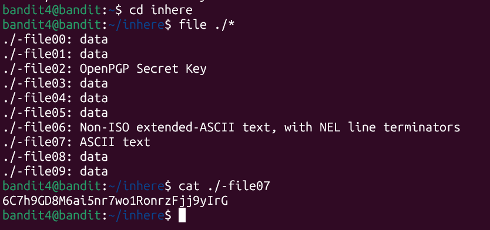

# Bandit Leve 4 -> Level 5

* **Objective:** Find the password stored in the only human -readable file inside the inhere directory.

* **Commands Used:** 
                     
                    cd inhere

                     file ./*
                     
                     cat ./-file07


* **What I Learned:** 
```
Most of the files in systems can contain raw data or complicated binary codes which look like garbage text if you cat them . 
    The file command analyzes a file's properties and tells you it's format.
Using the wildcard * lets you scan all files at once, quickly helping you spot the lone ASCII text file containing the password.
```

