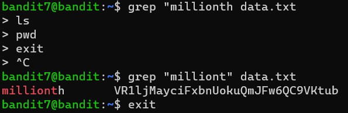

# Bandit Level 7 -> Level 8

* **Objective:** Find the password for the next level stored in the file `data.txt` next to the word `millionth`.
* **Commands Used:**
    
    `grep "millionth" data.txt`

* **What I used:** 
   
    `grep "milliont" data.txt`

* **What I Learned:**
    * `grep` is a pattern-matching utility used to scan a file for specific strings or keywords, completely bypassing the need to read through massive files manually.

    * Syntax precision is vital: failing to close a quotation mark (e.g., `grep "millionth data.txt`) causes the shell to open a multi-line prompt loop (`>`), waiting for the string to close.

    * If a terminal session gets stuck or trapped in an accidental multi-line loop, pressing **`Ctrl` + `C`** sends an interrupt signal (`^C`) that safely kills the current process and restores the regular user prompt.

    `grep` supports partial matching, which is why searching for `"milliont"` successfully retrieved the line containing the word `"millonth"`.

## Screenshots

### Execution & Verification

* **Password Saved:**              
  VR1ljMayciFxbnUokuQmJFw6QC9VKtub