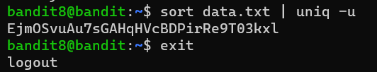

# Bandit Level 8 -> Level 9

* **Objective:** Find the password for the next level stored in the file `data.txt`. The password is the only line of tex that occurs exactly once.
* **Commands Used:**
    ```
    sort data.txt | uniq -u
    ```

* **What I Learned:**
    * `sort`: Arranges the lines of text in the file alphabetically. This is a critical step because the `uniq` command can only spot duplicate lines if they are placed right next to each other.
    * `|` (The Pipe): Links commands together by passing the standard output of the left command straight as input to the command on the right.
    * `uniq -u`: Filters the sorted stream to strictly display lines that are completely unique (appearing exactly once in the entire file).

## Screenshots

### Execution & Verification


* **Password Saved:**

     `EjmOSvuAu7sGAHqHVcBDPirRe9T03kxl`    
     
     