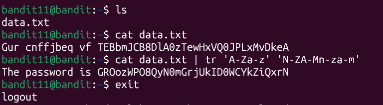

# Bandit Level 11 -> Level 12

* **Objective:** Find the password for the next level stored in `data.txt`, where all letters have been rotated by 13 positions (ROT13).
* **Commands Used:**
    ```
    cat data.txt | tr 'A-Za-z' 'N-ZA-Mn-za-m'
    ```

* **What I Learned:**
    * `tr`: A command-line utility used for translating or deleting characters from a text stream.
    * `ROT13`: A substitution cipher where letters are shifted 13 places forward in the alphabet. Running the rotation a second time completely decodes it.
              `tr translates characters`
              `ROT13 rotates letters by 13 positions`
              `Pipes (|) pass output between commands`

## Screenshots

### Execution & Verification


* **Password Saved:** [GROozWPO8QyN0mGrjUkID0WCYkZiQxrN]